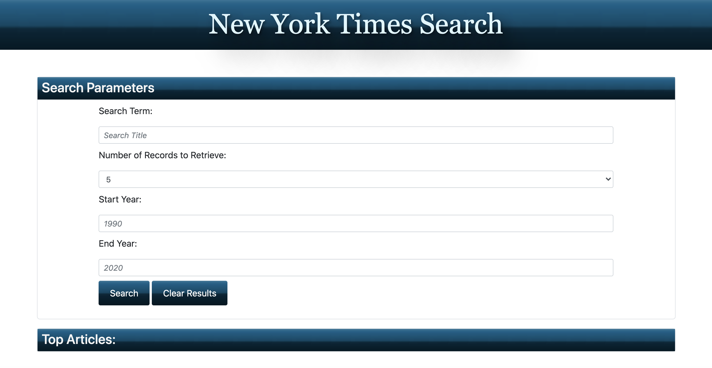

# NYTimes_search

## Description

For this group project, I worked alongside a team to create a New York Times article search application. The user is able to search for any article by a title or any term and also specify a start and end year for the results. The user is able to pick between 1, 5, and 10 records to be retrieved. 

The project has been deployed at a live URL. To access the live URL, please click here [NYTimes_search](https://alexhstrickland.github.io/NYTimes_search/).

## Usage

When accessing the website, you will type in a search term/title, start year, end year, and choose how many records to be retrieved in the search. If you would like to view a screenshot of the website, check out .